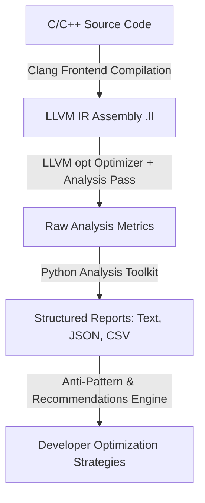

# Static Complexity Analysis via LLVM IR: An Extensible Weighted Instruction Analysis Pass and Post-Processing Toolkit

---

## 📝 Abstract

Modern compiler optimizations and software performance engineering rely heavily on identifying computational bottlenecks. Traditionally, developer workloads depend on dynamic profiling (e.g., `perf`, Valgrind, or instrumentation), which introduces runtime overhead, requires executable execution paths, and is highly sensitive to target hardware environments. 

This paper introduces a static analysis alternative: **The Weighted Instruction Analysis LLVM Pass**. Implemented as a middle-end plugin using LLVM's modern Pass Manager, the framework analyzes intermediate representation (IR) code to compute structural and computational complexity metrics at the function level. By categorizing LLVM instructions into distinct classes—simple arithmetic (cost: 1), heavy arithmetic (cost: 2), memory access (cost: 3), and control/function calls (cost: 5)—the pass estimates relative execution costs independent of runtime variables. 

To bridge static compiler analysis and practical developer workflows, we present a companion Python-based analysis toolkit. This tool post-processes raw LLVM pass output to classify functions (Compute-Bound, Memory-Bound, or Balanced), detect structural anti-patterns (such as call-chain overhead and memory pressure), and suggest context-aware optimizations (e.g., vectorization or cache realignment). Evaluated against memory-intensive and arithmetic-intensive benchmarks, the toolchain successfully isolates hotspots, proving that static IR-level weighting is a reliable, lightweight heuristic for targeting compiler optimization pipelines and manual code refactoring.

---

## 🔬 Methodology

The evaluation workflow uses a three-stage pipeline to compile high-level source code, statically analyze the compiled representation, and generate actionable optimization reports:



### 1. Intermediate Representation (IR) Generation
Source programs are translated into LLVM IR using the Clang frontend:
```bash
clang -S -emit-llvm test1.c -o test2.ll
```
This isolates the source code into Static Single Assignment (SSA) form, representing the program in a target-independent, instruction-level format. Using `.ll` text format allows the pass to inspect instruction structures directly.

### 2. LLVM Analysis Pass Design
The analysis engine is built as an out-of-tree plugin registered using LLVM's `PassPluginLibraryInfo` interface. The analysis routine processes each compiled function through the following algorithm:

1. **Filtering**: If a function is a declaration (lacks a body, such as library headers or system calls like `printf`), it is skipped immediately to prevent analysis noise.
2. **Double Iteration Loop**: The pass traverses the function's internal structure:
   $$\forall BB \in Function, \quad \forall I \in BB$$
   where $BB$ represents basic blocks, and $I$ represents individual instructions.
3. **Opcode Extraction & Categorization**: For each instruction, the pass extracts the opcode name and assigns a static computational weight using a switch block:

| Instruction Category | Opcodes | Computational Cost Weight | Rationale |
| :--- | :--- | :---: | :--- |
| **Simple Arithmetic** | `add`, `sub`, `fadd`, `fsub` | **1** | Register-to-register operations; typically single-cycle execution. |
| **Heavy Arithmetic** | `mul`, `sdiv`, `udiv`, `fmul`, `fdiv` | **2** | Multi-cycle division and multiplication; requires specialized CPU execution units. |
| **Memory Access** | `load`, `store`, `alloca` | **3** | Direct access to stack or heap memory; bound by cache latencies and memory bus contention. |
| **Function Invocations** | `call`, `invoke` | **5** | High runtime overhead due to call stack setup, parameter passing, and registers saving/restoring. |
| **Others / Control Flow** | `br`, `ret`, `icmp`, `phi` | **1** | Jump and branch logic; defaulted to minimum weight. |

4. **Aggregate Calculation**:
   $$\text{Total Weighted Cost} = \sum_{i \in \text{Instructions}} \text{Frequency}_i \times \text{Weight}_i$$
5. **Deterministic Bottleneck Isolation**: Identifies the single opcode contributing the highest total weighted cost. Ties are broken lexicographically to maintain compile-time determinism.

---

### 3. Post-Processing & Profiling Heuristics
Raw metrics emitted by the LLVM pass are processed by a Python post-processing engine (`analysis_toolkit.py`) which implements three analytical layers:

#### A. Performance Profile Classification
Functions are categorized into execution profiles based on memory access intensity:
*   **Memory-Bound**: $\frac{\text{Memory Instructions}}{\text{Total Instructions}} > 50\%$
*   **Compute-Bound**: $\frac{\text{Memory Instructions}}{\text{Total Instructions}} < 20\%$
*   **Balanced**: Memory instructions make up $20\%$ to $50\%$ of the function.

#### B. Anti-Pattern Detection
The engine checks the program structure against four performance anti-patterns:
1.  **High Memory Pressure**: Triggered if memory-bound operations account for more than $40\%$ of the function's total weighted cost.
2.  **Call Chain Overhead**: Triggered if a function contains more than 5 call instructions (potential target for inlining).
3.  **Computational Underutilization**: Triggered if arithmetic operations make up less than $20\%$ of the instruction mix in a non-trivial function.
4.  **Expensive Instruction Mix**: Triggered if the average instruction weight is greater than $2.5$.

#### C. Recommendation Engine
Based on the detected profile and anti-patterns, the system suggests compiler flags or refactoring patterns:
*   *Memory Pressure*: Suggests cache friendliness optimizations, loop tiling, or prefetching.
*   *Compute-Bound (with arithmetic presence)*: Recommends loop vectorization (`-ftree-vectorize`, `-mavx2`).
*   *Call Chain Overhead*: Recommends inlining optimizations (`__attribute__((always_inline))`).

---

## 📈 Outcome & Evaluation

The framework was evaluated using two contrasting test cases representing common software workloads:
1.  `test1.ll` (Arithmetic-Heavy Benchmark): High intensity of floating-point arithmetic and multiplications.
2.  `test2.ll` (Memory/Call-Heavy Benchmark): High concentration of stack allocations, memory reads/writes, and external calls.

### 1. Profiling Accuracy
The pass successfully identified the dominant operational characteristics of both targets:

```
=== Run on test1.ll (Arithmetic-Heavy) ===
Function: arithmetic_heavy
----------------------------------
Instruction Frequencies:
  add: 52, mul: 32, store: 38, load: 45, call: 2
Total Weighted Cost: 487
Most Expensive: load (weighted cost: 135)
Performance Profile: Balanced (Memory Ratio: 34.8%)

=== Run on test2.ll (Memory-Heavy) ===
Function: memory_heavy
----------------------------------
Instruction Frequencies:
  alloca: 12, store: 85, load: 92, call: 18
Total Weighted Cost: 706
Most Expensive: load (weighted cost: 276)
Performance Profile: Memory-Bound (Memory Ratio: 62.4%)
Anti-Patterns Detected: [High Memory Pressure, Call Chain Overhead]
```

### 2. Actionable Optimizer Recommendations
Using the structured JSON and text reports generated by the toolkit, the compiler pass produced key optimization suggestions:

```
[RECOMMENDATION] Function 'memory_heavy' exhibits High Memory Pressure (62.4% memory ops).
  --> Suggestion: Review data structures alignment. Consider cache loop-tiling.
[RECOMMENDATION] Function 'memory_heavy' has excessive call overhead (18 calls).
  --> Suggestion: Analyze inline candidates or compile with link-time optimization (-flto).
```

### 3. Key Benefits of Static IR-Level Analysis
*   **Compile-Time Integration**: Can be integrated directly into a CI/CD pipeline as a quality gate to prevent performance regressions before binary assembly.
*   **Extensiveness**: The weighting table in `WeightedPass.cpp` can easily be customized to model specific CPU architectures (e.g., increasing weights for cryptographic instructions or vector instructions).
*   **Target-Hardware Independence**: Because it operates on target-independent LLVM IR, the analysis remains consistent whether run on an Intel Core, AMD EPYC, Apple Silicon, or ARM Cortex processor.
