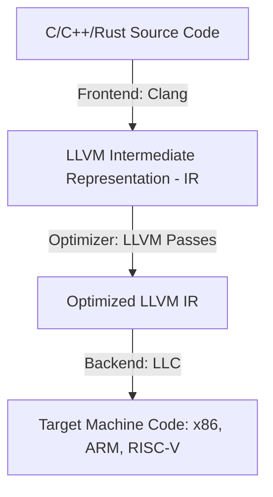

# 📖 Comprehensive Theory & Stepwise Guide: LLVM IR & Weighted Instruction Analysis Pass

This document provides a highly detailed theoretical background and a step-by-step codebase walkthrough for the **Weighted Instruction Analysis LLVM Pass**. It covers how compilers work, the LLVM framework architecture, details on compiling C code to LLVM IR, and a line-by-line explanation of the pass codebase.

---

## 🔬 Part 1: Compiler Architecture & LLVM Theory

### 1. The Classic Three-Phase Compiler Architecture
Modern compilers, including LLVM, are structured into three distinct phases to maximize portability and maintainability:



1. **Frontend (e.g., Clang)**: Parses source code (C/C++), performs semantic analysis, syntax checking, and translates the code into a target-independent **Intermediate Representation (IR)**.
2. **Optimizer/Middle-end (LLVM core)**: Performs optimizations on the target-independent IR. This is where analysis and transformation **passes** run. Examples include Dead Code Elimination (DCE), Loop Unrolling, and Inlining.
3. **Backend (e.g., LLC)**: Takes the optimized target-independent IR and translates it into target-specific assembly or machine code (e.g., x86, ARM, RISC-V).

---

### 2. Deep Dive: LLVM Intermediate Representation (IR)
LLVM IR is a universal, strongly-typed, assembly-like language with an infinite set of virtual registers. It exists in three isomorphic (equivalent) forms:
*   **In-memory representation**: A C++ class hierarchy used by passes (e.g., `llvm::Instruction`, `llvm::BasicBlock`).
*   **On-disk binary bitcode (.bc)**: A compact binary format used for distribution and fast parsing.
*   **On-disk human-readable assembly (.ll)**: A text-based format used by developers for inspection and debugging.

#### Static Single Assignment (SSA)
LLVM IR uses **Static Single Assignment (SSA)** form. In SSA:
*   Every variable (register) is assigned **exactly once**.
*   This simplifies dataflow analysis because the definition site of any variable is uniquely determined by its identifier.

#### Transforming Source Code to LLVM IR
To analyze code with an LLVM pass, we must first convert the high-level language source code (C/C++) into LLVM IR. We do this using the Clang frontend.

The following command compiles a C file into human-readable LLVM IR assembly:

```bash
clang -S -emit-llvm test1.c -o test2.ll
```

##### Command Arguments Breakdown:
*   `clang`: The compiler frontend tool.
*   `-S`: Instructs Clang to stop after the compilation/translation phase (do not assemble or link to machine code).
*   `-emit-llvm`: Directs Clang to generate LLVM Intermediate Representation (IR) instead of target-specific machine assembly (such as x86 or ARM assembly).
*   `test1.c`: The input C source file containing high-level code.
*   `-o test2.ll`: Specifies the output filepath. The `.ll` extension indicates human-readable LLVM assembly text.

> [!TIP]
> If you wish to compile to LLVM binary bitcode instead, run:
> ```bash
> clang -c -emit-llvm test1.c -o test2.bc
> ```
> You can then convert the binary bitcode back to human-readable IR using the LLVM disassembler:
> ```bash
> llvm-dis test2.bc -o test2.ll
> ```

---

### 3. What is an LLVM Pass?
An **LLVM Pass** is a modular unit of compiler code that inspects or transforms LLVM IR. Passes are categorized into:
*   **Analysis Passes**: Gather information about the code (e.g., control flow structure, instruction count) without modifying it. The *Weighted Instruction Analysis Pass* is an analysis pass.
*   **Transformation Passes**: Modify the IR to optimize performance, size, or safety.

#### The New Pass Manager (LLVM 10+)
This codebase is built using LLVM's modern **New Pass Manager**, which features:
*   An efficient caching mechanism for analysis results.
*   Conformant C++ class design utilizing CRTP (Curiously Recurring Template Pattern) via `PassInfoMixin`.
*   A simpler pipeline parsing registration system.

---

## 💻 Part 2: Line-by-Line Codebase Explanation (`src/WeightedPass.cpp`)

Let us explore the core implementation file, [WeightedPass.cpp](file:///c:/code-2026/cdel/Weighted-Instruction-Analysis-Pass/src/WeightedPass.cpp), in absolute detail.

### 1. Headers and namespaces (Lines 1-13)
```cpp
#include "llvm/Passes/PassBuilder.h"
#include "llvm/Passes/PassPlugin.h"
#include "llvm/IR/Function.h"
#include "llvm/IR/BasicBlock.h"
#include "llvm/IR/Instructions.h"
#include "llvm/Support/raw_ostream.h"

#include <map>
#include <string>
#include <algorithm>

using namespace llvm;
```
*   `llvm/Passes/PassBuilder.h` & `PassPlugin.h`: Provide the registration APIs for LLVM pass plugins.
*   `llvm/IR/Function.h`: Defines the `Function` class representing a compiled function.
*   `llvm/IR/BasicBlock.h`: Defines a sequence of straight-line instructions containing a single entry and single exit point.
*   `llvm/IR/Instructions.h`: Defines specific LLVM IR instructions (like `LoadInst`, `StoreInst`, etc.).
*   `llvm/Support/raw_ostream.h`: Provides LLVM's highly optimized output stream (`llvm::outs()`, `llvm::errs()`).

---

### 2. Pass Definition & CRTP (Lines 14-20)
```cpp
namespace {

struct WeightedInstructionAnalysis : public PassInfoMixin<WeightedInstructionAnalysis> {
  PreservedAnalyses run(Function &F, FunctionAnalysisManager &FAM) {
    if (F.isDeclaration()) {
      return PreservedAnalyses::all();
    }
```
*   `namespace { ... }`: The anonymous namespace limits the visibility of the pass structure to this translation unit, preventing symbol collisions.
*   `PassInfoMixin<T>`: A helper template that uses CRTP to inject standard metadata, such as the pass name, into our class.
*   `run(Function &F, FunctionAnalysisManager &FAM)`: The entrypoint method invoked by LLVM's Pass Manager. It receives:
    *   `Function &F`: A reference to the function currently being processed.
    *   `FunctionAnalysisManager &FAM`: Used to query other analysis passes.
*   `F.isDeclaration()`: Checks if the function is just a declaration (like `extern void foo();` or `printf`) without a function body. We immediately skip declarations because they contain no instructions to analyze, returning `PreservedAnalyses::all()` to state that no analyses were modified.

---

### 3. Iterating Instructions & Weighting Logic (Lines 22-67)
```cpp
    std::map<std::string, int> Frequencies;
    int TotalWeightedCost = 0;

    // Iterate all basic blocks and instructions in the function
    for (BasicBlock &BB : F) {
      for (Instruction &I : BB) {
        std::string OpcodeName = I.getOpcodeName();
        Frequencies[OpcodeName]++;

        int Weight = 1;
        unsigned Opcode = I.getOpcode();
        switch (Opcode) {
          // add/sub/fadd/fsub = 1
          case Instruction::Add:
          case Instruction::Sub:
          case Instruction::FAdd:
          case Instruction::FSub:
            Weight = 1;
            break;
          // mul/div/fmul/fdiv = 2
          case Instruction::Mul:
          case Instruction::SDiv:
          case Instruction::UDiv:
          case Instruction::FMul:
          case Instruction::FDiv:
            Weight = 2;
            break;
          // load/store/alloca = 3
          case Instruction::Load:
          case Instruction::Store:
          case Instruction::Alloca:
            Weight = 3;
            break;
          // call/invoke = 5
          case Instruction::Call:
          case Instruction::Invoke:
            Weight = 5;
            break;
          // all others = 1
          default:
            Weight = 1;
            break;
        }
        TotalWeightedCost += Weight;
      }
    }
```
*   `Frequencies`: A dictionary mapping opcode names (strings like `"add"`, `"load"`) to their raw count.
*   Nested Loop:
    *   `BasicBlock &BB : F`: Loops over every basic block in the function.
    *   `Instruction &I : BB`: Loops over every instruction sequentially in that basic block.
*   `I.getOpcodeName()`: Retrieves the opcode string representation.
*   `I.getOpcode()`: Retrieves the opcode integer enum (e.g., `Instruction::Add`).
*   `switch (Opcode)`: Maps each instruction to a pre-defined relative execution cost weight:
    *   **Weight 1 (Simple Arithmetic)**: `add` (integer addition), `sub` (integer subtraction), `fadd` (floating-point addition), `fsub` (floating-point subtraction).
    *   **Weight 2 (Complex Math)**: `mul` (integer multiplication), `sdiv`/`udiv` (signed/unsigned integer division), `fmul`/`fdiv` (floating-point multiplication/division).
    *   **Weight 3 (Memory Latency)**: `load` (reading from memory), `store` (writing to memory), `alloca` (stack pointer allocation).
    *   **Weight 5 (Function Latency)**: `call` (ordinary function call), `invoke` (a call that can throw exceptions, requiring landing pad setup).
    *   **Weight 1 (Defaults)**: Control flow branch (`br`), comparisons (`icmp`), phis, return (`ret`), etc.
*   `TotalWeightedCost += Weight`: Accumulates the cost of every instruction to model function execution complexity.

---

### 4. Identifying the Bottleneck (Lines 69-97)
```cpp
    // Identify the most expensive instruction type (by weighted cost)
    std::string MostExpensiveType = "";
    int MaxWeightedCost = -1;

    for (auto const& [OpcodeName, Count] : Frequencies) {
      int Weight = 1;
      if (OpcodeName == "add" || OpcodeName == "sub" || OpcodeName == "fadd" || OpcodeName == "fsub") {
        Weight = 1;
      } else if (OpcodeName == "mul" || OpcodeName == "sdiv" || OpcodeName == "udiv" || OpcodeName == "fmul" || OpcodeName == "fdiv") {
        Weight = 2;
      } else if (OpcodeName == "load" || OpcodeName == "store" || OpcodeName == "alloca") {
        Weight = 3;
      } else if (OpcodeName == "call" || OpcodeName == "invoke") {
        Weight = 5;
      } else {
        Weight = 1;
      }

      int WeightedCost = Count * Weight;
      if (WeightedCost > MaxWeightedCost) {
        MaxWeightedCost = WeightedCost;
        MostExpensiveType = OpcodeName;
      } else if (WeightedCost == MaxWeightedCost) {
        // Lexicographical tie-breaker for deterministic output
        if (MostExpensiveType.empty() || OpcodeName < MostExpensiveType) {
          MostExpensiveType = OpcodeName;
        }
      }
    }
```
*   This block calculates which *category* of instructions contributes the most to the runtime cost.
*   `WeightedCost = Count * Weight`: Evaluates the aggregate weight per instruction opcode.
*   **Tie-breaking logic**: If two instruction types have identical aggregate costs (e.g. 10 load instructions @ weight 3 = 30, and 6 call instructions @ weight 5 = 30), we choose the alphabetically smaller one (`OpcodeName < MostExpensiveType`) to ensure deterministic output across platform compilers.

---

### 5. Formatting Output & Preserved Analyses (Lines 99-113)
```cpp
    // Print formatted output to llvm::outs()
    outs() << "==================================\n";
    outs() << "Function: " << F.getName() << "\n";
    outs() << "==================================\n";
    outs() << "Instruction Frequencies:\n";
    for (auto const& [OpcodeName, Count] : Frequencies) {
      outs() << "  " << OpcodeName << ": " << Count << "\n";
    }
    outs() << "Total Weighted Cost: " << TotalWeightedCost << "\n";
    outs() << "Most Expensive Instruction Type: " << MostExpensiveType 
           << " (weighted cost: " << MaxWeightedCost << ")\n";
    outs() << "==================================\n";

    return PreservedAnalyses::all();
  }
};
```
*   `outs() << ...`: Prints results to LLVM standard output stream.
*   `PreservedAnalyses::all()`: Since this pass only inspects instruction counts and prints statistics, it does **not** change the basic blocks, control flow, or operands. Thus, we declare that all analyses are preserved. This tells LLVM that it does not need to invalidate or re-run other analyses (like dominator trees or loop info).

---

### 6. Pass Plugin Registration (Lines 118-135)
```cpp
// Register the pass with the LLVM pass infrastructure
extern "C" ::llvm::PassPluginLibraryInfo llvmGetPassPluginInfo() {
  return {
    LLVM_PLUGIN_API_VERSION, "weighted-instruction-analysis", "1.0",
    [](PassBuilder &PB) {
      PB.registerPipelineParsingCallback(
          [](StringRef Name, FunctionPassManager &FPM,
             ArrayRef<PassBuilder::PipelineElement>) {
            if (Name == "weighted-instruction-analysis") {
              FPM.addPass(WeightedInstructionAnalysis());
              return true;
            }
            return false;
          });
    }
  };
}
```
*   `extern "C"`: Instructs the C++ compiler to use C-style symbol name mangling. This allows LLVM's dynamic loader (`dlsym`) to find the entrypoint function `llvmGetPassPluginInfo`.
*   `llvmGetPassPluginInfo()`: The entry point function called by `opt` when loading the plugin library. It returns a `PassPluginLibraryInfo` struct:
    1.  `LLVM_PLUGIN_API_VERSION`: Compiled API version compatibility check.
    2.  `"weighted-instruction-analysis"`: Name of the pass.
    3.  `"1.0"`: Version string.
    4.  **Registration callback**: A lambda function that runs when configuring the pass pipeline.
*   `registerPipelineParsingCallback`: Attaches a listener to the parser. When the parser encounters the pass string `weighted-instruction-analysis` in the `-passes` command argument, it appends an instance of our `WeightedInstructionAnalysis` pass to the `FunctionPassManager (FPM)`.

---

## 🏃‍♂️ Part 3: Stepwise Workflow: From C Source to Pass Analysis

Here is the stepwise execution sequence showing exactly what happens under the hood.

### Step 1: Generate LLVM IR from C Source
We translate human-readable C code to human-readable intermediate representation.

```bash
# Compile input code test1.c into LLVM IR
clang -S -emit-llvm test1.c -o test2.ll
```
*   **What it does**: Clang parses the syntax trees of `test1.c`, does static checking, builds type signatures, and converts local variables and control flows into static single-assignment instructions (registers like `%1`, `%2`) inside `test2.ll`.

### Step 2: Build the Pass Plugin
Generate the dynamic library that LLVM's `opt` program can load:

```bash
# Setup build directory and build
mkdir -p build && cd build
cmake -DCMAKE_BUILD_TYPE=Release ..
make
cd ..
```
*   **What it does**: CMake queries `llvm-config` to acquire header paths and compilation flags. The C++ compiler compiles `WeightedPass.cpp` and links it into a dynamic loadable module `build/WeightedInstructionAnalysis.so` (or `.dylib` on macOS).

### Step 3: Run the Pass
Load the shared library into LLVM's optimizer and execute the analysis:

```bash
opt -load-pass-plugin=build/WeightedInstructionAnalysis.so \
    -passes=weighted-instruction-analysis \
    -disable-output \
    test2.ll
```
*   **What it does**:
    1.  `opt` starts and dynamically loads the pass library via `dlopen`.
    2.  It invokes `llvmGetPassPluginInfo` to register `weighted-instruction-analysis`.
    3.  It parses `test2.ll` into LLVM's in-memory representation.
    4.  It sets up a pipeline with our pass and feeds each function into `WeightedInstructionAnalysis::run()`.
    5.  Our code prints the analysis metrics directly to standard output.
    6.  `-disable-output` prevents `opt` from emitting optimized LLVM bitcode to the terminal since we are only interested in the print statements.
